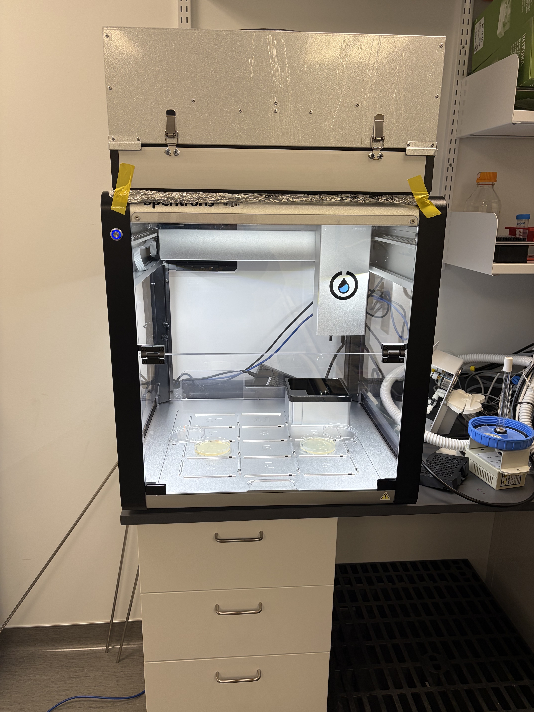
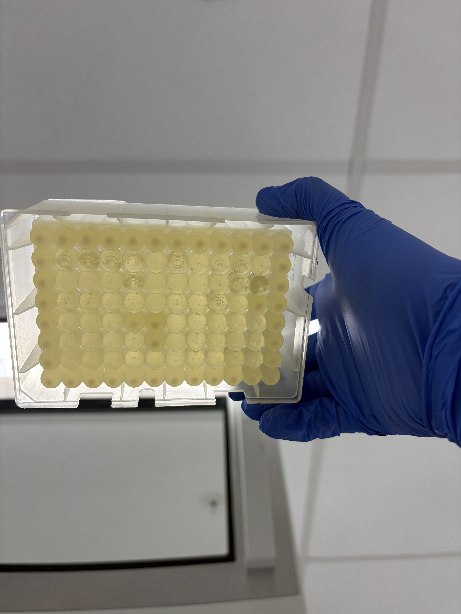
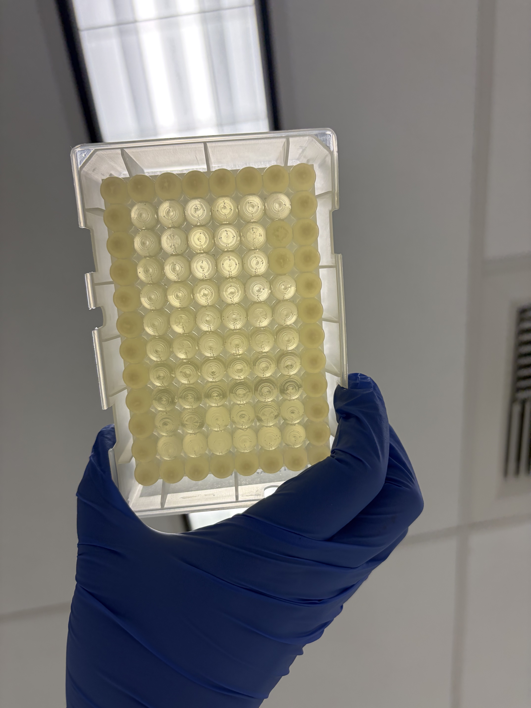

# Opentrons Filter — Sterility Validation Experiment

**Tags:** bacteria, opentrons, wetlab
**Date:** March 3–6, 2026
**Author:** Angie Aguirre-Tobar
**Status:** Trying Again 🔄
**Protocol file:** [`bac_distribution.py`](bac_distribution.py)

---

## Background and Motivation

Previous *E. coli* liquid culture experiments run on the OT-2R produced growth, but without sequencing it was impossible to confirm that all colonies were the intended strain. In microbiological work, an uncontrolled open-bench environment introduces a real risk of mixed-species contamination. Biosafety cabinets (BSCs) prevent this through HEPA-filtered laminar airflow, but the OT-2R has no built-in sterility mechanism.

**The question:** can a HEPA filter mounted on top of the OT-2R — sealing the robot's working volume — replicate BSC-level sterility well enough for bacterial liquid culture work?

---

## Hypothesis

Attaching a HEPA air filter to the top of the OT-2R and sealing the overhang with styrofoam and aluminium foil will create a sufficiently sterile enclosed environment, equivalent in practice to running inside a BSC.

---

## Materials

- OT-2R robot
- HEPA filter (fan-mounted)
- Styrofoam and aluminium foil (for edge sealing)
- LB agar plates (plain LB and LB + Ampicillin)
- 2 mL 96-well plates (Integra)
- *E. coli* overnight culture expressing 3×FLAG_pa_Tn5 (in LB + Amp)
- Gloves

---

## Part 1 — Agar Plate Settle Test

### Setup

The plastic top cover of the OT-2R was removed. The HEPA filter was placed on top and its overhanging edges sealed with styrofoam and aluminium foil to close off airflow around the sides. Two open agar plates were placed directly on the robot deck — one LB + Ampicillin and one plain LB — to capture any airborne contamination settling onto the agar surface.

### Protocol

1. Remove the top plastic cover from the OT-2R
2. Place the HEPA filter on top; seal overhanging edges with styrofoam and aluminium foil
3. **Fan off** — place one LB + Amp and one plain LB agar plate on the deck (uncovered)
4. Let sit open for 2 hours
5. Cover plates; incubate overnight at 30°C
6. Remove plates; **turn fan on at high speed** for 5 minutes
7. Place fresh plates on the deck under the same conditions
8. Let sit open for 2 hours
9. Cover plates; incubate overnight at 30°C

### Agar Plate Results

**Fan off (filter sealed):**

| | LB + Amp | Plain LB |
|---|---|---|
| **Filter ON** | Small growth observed | No growth |
| **No filter** | No growth | No growth |

*LB + Amp, no filter — clean.*

*LB + Amp, filter ON — clean.*

*Plain LB, filter ON — clean.*

*Plain LB, no filter — clean.*

### Agar Plate Interpretation

The agar settle test showed minimal contamination across all conditions, making it hard to draw strong conclusions. The small amount of growth on LB + Amp with fan off was unexpected — Amp resistance is strain-specific, suggesting the contamination (if real) came from an Amp-resistant environmental organism rather than ambient lab flora. Plain LB plates showed nothing, which is unusual since a truly contaminated environment would typically show more growth on permissive media. The overall result was inconclusive enough to push the experiment to a more sensitive liquid culture readout.

---

## Part 2 — Liquid Culture Sterility Test

### Rationale

Liquid culture is more sensitive than agar settle plates for detecting low-level contamination — a single viable contaminant cell can multiply to a detectable OD₆₀₀ in 24 hours, whereas it might not form a visible colony on agar. The test also mimics the actual use case: running `bac_distribution.py` on the OT-2R with real bacterial cultures.

### Contamination Source

An overnight culture of *E. coli* expressing **3×FLAG_pa_Tn5** was used as the deliberate contamination source. This strain requires Ampicillin selection, making it identifiable: any growth in LB + Amp wells indicates the *E. coli* inoculant, while growth in plain LB without Amp would indicate an Amp-sensitive contaminant from the environment.

The protocol intentionally creates opportunities for splash and aerosol: mixing steps, blow-out commands, and high-volume transfers from 15 mL conical tubes all generate droplets that could contaminate adjacent wells or the air.

### Liquid Culture Protocol Parameters

- **Labware:** 2 mL 96-well plate (Integra)
- **Inoculation pattern:** edge wells only (rows A and H, columns 1 and 12)
- **Dilution:** ~1:100 (*E. coli* ON culture into LB + Amp media)
- **Source:** 1× 15 mL overnight culture tube
- **Protocol file:** [`bac_distribution.py`](bac_distribution.py)
- **Run time:** 1 hour 20 minutes

### Deck Layout

### Liquid Culture Results — With Filter

### Liquid Culture Results — Without Filter

### OD₆₀₀ Results

| Condition | OD₆₀₀ | Absorbance A |
|---|---|---|
| **Filter ON** | 0.02 | 0.02 |
| **No Filter** | 2.39 | 2.54 |

The filter condition produced an OD₆₀₀ of 0.02 — essentially at baseline, indicating no meaningful bacterial growth. The no-filter condition produced OD₆₀₀ of 2.39, a ~120× higher signal, consistent with robust *E. coli* growth from inoculation.

---

## Conclusions

The liquid culture data tells a clearer story than the agar plates:

**The filter suppressed growth completely.** OD₆₀₀ = 0.02 in the filter condition means no detectable *E. coli* proliferation, even though the run involved mixing, blow-out, and liquid transfer steps that would normally aerosolize bacteria throughout the deck. This is the most promising result so far.

**The no-filter condition grew robustly.** OD₆₀₀ = 2.39 confirms the *E. coli* inoculant is viable and the assay is sensitive enough to detect contamination — the filter, not some artefact, is responsible for suppressing growth in the other condition.

**Open questions and things to fix for the next run:**

- **Pipette starting position** — the current protocol aspirates from the bottom of the 15 mL conical tube, which causes splashing as liquid is drawn up. Starting aspiration from the top of the liquid and tracking liquid level downward would reduce aerosol generation and may reduce drippage observed on the plates.
- **Fan pressure on robot arm** — there is a concern that airflow from the fan is pushing against the pipette arm, possibly altering applied force during tip pickup and dispense. The second run (no filter) subjectively appeared to use "less force," which might be related to reduced air resistance. This should be characterized more carefully.
- **Drippage** — the first (filter) run had noticeably more liquid drip visible on and around the plate than the second run. This may be related to the sealed environment causing humidity buildup, or to the aspiration-from-bottom issue above.
- **Sterility not 100% confirmed** — while the filter condition did not grow *E. coli*, a single negative result does not fully establish sterility. A full validation would require sequencing or replicate runs with positive and negative controls built into the plate layout.
- **Protocol runtime** — 1 hour 20 minutes is long for a distribution run. Optimizations to consider: reduce mixing/blow-out repetitions, increase pipette speed for non-critical transfers, minimize tip changes where contamination risk is low.

**Next steps:** Re-run with the aspiration height corrected (start from liquid surface, not tube bottom), add an explicit negative control region to the plate (wells never inoculated), and run 3+ replicates to build confidence in the filter's reproducibility.

---

## Files

| File | Description |
|---|---|
| [`bac_distribution.py`](bac_distribution.py) | Protocol used for the liquid culture inoculation run |
| `IMG_0012_filter_setup.jpeg` | Filter and fan assembly mounted on OT-2R |
| `IMG_0050_agar_no_filter_LBAmp.jpeg` | LB + Amp agar plate, no filter, fan off |
| `IMG_0051_agar_filter_LBAmp.jpeg` | LB + Amp agar plate, filter ON, fan off |
| `IMG_0054_agar_filter_LB.jpeg` | Plain LB agar plate, filter ON |
| `IMG_0055_agar_no_filter_LB.jpeg` | Plain LB agar plate, no filter |
| `IMG_0070_liquid_culture_deck_setup.jpeg` | Deck layout for liquid culture run |
| `IMG_0080/0082_liquid_filter_result.jpeg` | 96-well plate after incubation — filter ON |
| `IMG_0099_liquid_filter_plates.jpeg` | Agar plates alongside reservoir — filter ON run |
| `IMG_0101_liquid_filter_reservoir.jpeg` | Integra reservoir — filter ON run |
| `IMG_0085/0087_liquid_no_filter_result.jpeg` | 96-well plate after incubation — no filter |
| `IMG_0104_liquid_no_filter_plates.jpeg` | Agar plates alongside reservoir — no filter run |
| `IMG_0107_liquid_no_filter_reservoir.jpeg` | Integra reservoir — no filter run |
